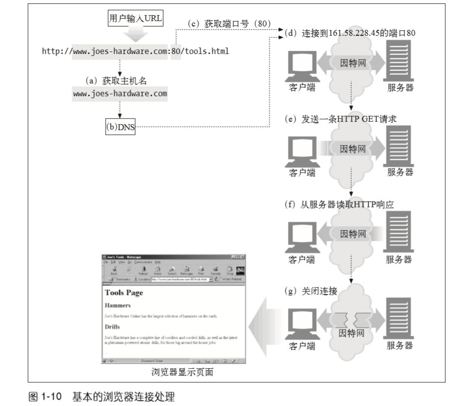

全栈
----------
HTTP 简介
## HTTP 工作原理
+  HTTP协议工作于客户端-服务端架构为上。浏览器作为HTTP客户端通过URL向HTTP服务端即WEB服务器发送所有请求。Web服务器根据接收到的请求后，向客户端发送响应信息。
+ Web服务器有：Apache服务器，IIS服务器（Internet Information Services）,nginx等。
+ HTTP默认端口号为80，但是你也可以改为8080或者其他端口
### 服务器

## HTTP 请求方法
1. GET	请求指定的页面信息，并返回实体主体。
2. HEAD  类似于get请求，只不过返回的响应中没有具体的内容，用于获取报头
3. POST 向指定资源提交数据进行处理请求（例如提交表单或者上传文件）。数据被包含在请求体中。POST请求可能会导致新的资源的建立和/或已有资源的修改。
4. PUT	从客户端向服务器传送的数据取代指定的文档的内容。
5. DELETE	请求服务器删除指定的页面。
6. CONNECT	HTTP/1.1协议中预留给能够将连接改为管道方式的代理服务器。
7. OPTIONS	允许客户端查看服务器的性能。
8. TRACE	回显服务器收到的请求，主要用于测试或诊断。
## HTTP 状态码
* 200 - 请求成功
* 301 - 资源（网页等）被永久转移到其它URL
* 404 - 请求的资源（网页等）不存在
* 500 - 内部服务器错误
## 数据库
* 分类
## 后端介绍
* url与路由
* 视图函数
* 模板
* module
